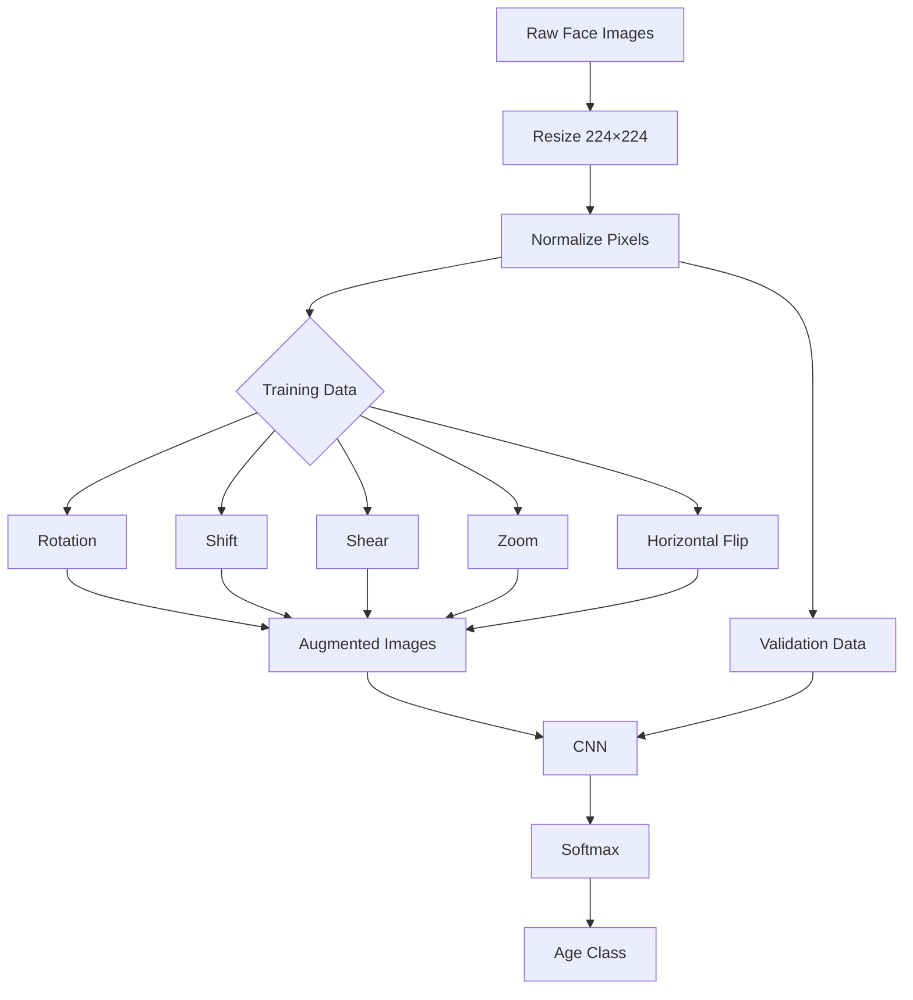

# 🧠 Face Age Detector

### Deep Learning • Computer Vision • CNN • TensorFlow • Streamlit

<p align="center">


</p>

<p align="center">

**An end-to-end deep learning system that analyzes a facial image and predicts its age group using a Convolutional Neural Network.**

</p>

---

## ✨ Project Overview

**Face Age Detector** is a computer vision project built using **TensorFlow/Keras** that classifies a person's face into one of three broad age categories:

| 👤 Category   | Approximate Range |
| ------------- | ----------------- |
| 🟢 **YOUNG**  | 0–25 years        |
| 🟡 **MIDDLE** | 26–60 years       |
| 🔴 **OLD**    | 60+ years         |

The project follows a complete machine-learning workflow:

> **Dataset → Data Analysis → Preprocessing → Augmentation → CNN → Training → Model Checkpointing → Prediction → Streamlit Deployment**

The trained model can be used through an interactive **Streamlit web application**, where users upload an image and receive the predicted age category together with confidence probabilities.

---

# 🎯 What Makes This Project Interesting?

This isn't just a model sitting inside a notebook.

It combines:

* 🧠 Deep Learning
* 👁️ Computer Vision
* 🖼️ Image Classification
* 📊 Exploratory Data Analysis
* 🔄 Image Augmentation
* ⚡ TensorFlow/Keras
* 🌐 Streamlit Deployment
* 📈 Prediction Confidence Visualization

The goal is to demonstrate the complete journey from **raw image data to an interactive AI application**.

---

# 🏗️ System Architecture


---

# 🧠 Neural Network Architecture

The model uses a straightforward **Convolutional Neural Network (CNN)** architecture.

```text
                    INPUT IMAGE
                  224 × 224 × 3
                         │
                         ▼
              ┌────────────────────┐
              │ Conv2D - 32 Filters │
              │      3 × 3          │
              │      ReLU           │
              └─────────┬──────────┘
                        ▼
              ┌────────────────────┐
              │   Max Pooling 2×2  │
              └─────────┬──────────┘
                        ▼
              ┌────────────────────┐
              │ Conv2D - 64 Filters │
              │      3 × 3          │
              │      ReLU           │
              └─────────┬──────────┘
                        ▼
              ┌────────────────────┐
              │   Max Pooling 2×2  │
              └─────────┬──────────┘
                        ▼
              ┌─────────────────────┐
              │ Conv2D - 128 Filters│
              │       3 × 3         │
              │       ReLU          │
              └──────────┬──────────┘
                         ▼
              ┌────────────────────┐
              │   Max Pooling 2×2  │
              └─────────┬──────────┘
                        ▼
                    Flatten
                        │
                        ▼
              ┌────────────────────┐
              │ Dense - 128 Neurons│
              │       ReLU         │
              └─────────┬──────────┘
                        ▼
                 Dropout 50%
                        │
                        ▼
              ┌────────────────────┐
              │   Softmax Output   │
              │ 3 Age Categories   │
              └────────────────────┘
```

---

# 🔬 Model Configuration

| Parameter        | Configuration                   |
| ---------------- | ------------------------------- |
| Architecture     | Convolutional Neural Network    |
| Framework        | TensorFlow / Keras              |
| Input Size       | `224 × 224 × 3`                 |
| Batch Size       | `32`                            |
| Optimizer        | Adam                            |
| Loss Function    | Sparse Categorical Crossentropy |
| Activation       | ReLU + Softmax                  |
| Dropout          | `0.5`                           |
| Output Classes   | `3`                             |
| Validation Split | `20%`                           |
| Random State     | `42`                            |

---

# 🖼️ Image Preprocessing

Every image is resized to:

```text
224 × 224 × 3
```

Pixel values are normalized:

```python
pixel_value / 255.0
```

### 🔄 Training Augmentation

To improve model generalization, the training pipeline applies:

* Rotation
* Width shifting
* Height shifting
* Shearing
* Zooming
* Horizontal flipping
* Nearest-neighbor filling

Validation images only undergo rescaling.

This creates a stronger training pipeline without artificially modifying the validation distribution.

---

# 📊 Data Pipeline



---

# 📁 Project Structure

```text
Face-Age-Detector/
│
├── 📓 Age_Detector.ipynb
│
├── 🧠 best_model.keras
│
├── 🌐 app.py
│
├── 📊 README.md
│
└── 📦 requirements.txt
```

Recommended repository structure:

```text
📦 Face-Age-Detector
 ┣ 📓 Age_Detector.ipynb
 ┣ 🧠 best_model.keras
 ┣ 🌐 app.py
 ┣ 📄 requirements.txt
 ┣ 📄 README.md
 ┗ 📁 screenshots
    ├── home.png
    ├── prediction.png
    └── confidence.png
```

---

# 🌐 Streamlit Application

The project includes an interactive web interface.

### User Flow

```text
📸 Upload Image
       ↓
🖼️ Image Processing
       ↓
🧠 CNN Inference
       ↓
🎯 Predicted Age Group
       ↓
📊 Confidence Visualization
```

The application displays:

### 📷 Uploaded Image

The user's image is shown directly inside the application.

### 🎯 Prediction

Example:

```text
Prediction:
Young (0–25 years)

Confidence:
87.42%
```

### 📊 Confidence Distribution

The application also visualizes the probability assigned to each class:

```text
YOUNG   ████████████████████  87%
MIDDLE  ███                    10%
OLD     █                         3%
```

---

# 🚀 Running the Project Locally

## 1️⃣ Clone the Repository

```bash
git clone https://github.com/YOUR_USERNAME/Face-Age-Detector.git

cd Face-Age-Detector
```

## 2️⃣ Install Dependencies

```bash
pip install tensorflow streamlit pandas numpy pillow matplotlib seaborn scikit-learn kagglehub
```

Or:

```bash
pip install -r requirements.txt
```

## 3️⃣ Train the Model

Open:

```text
Age_Detector.ipynb
```

Run the notebook cells sequentially.

The best model is saved as:

```text
best_model.keras
```

## 4️⃣ Start the Streamlit Application

```bash
streamlit run app.py
```

The application will open in your browser.

---

# 🧪 Prediction Example

```text
             ┌─────────────────────┐
             │     INPUT IMAGE      │
             │         👤           │
             └──────────┬──────────┘
                        │
                        ▼
                 🧠 CNN MODEL
                        │
                        ▼
          ┌────────────────────────┐
          │    CLASS PROBABILITIES │
          ├────────────────────────┤
          │ Young   → 87.42%       │
          │ Middle  → 10.15%       │
          │ Old     →  2.43%       │
          └────────────┬───────────┘
                       │
                       ▼
              🎯 YOUNG
```

> **Note:** The percentages above are illustrative. Actual confidence values depend on the uploaded image.

---

# 📈 Model Evaluation

The notebook currently trains the model for **1 epoch**, so this repository should **not claim a final accuracy benchmark** unless additional training/evaluation has been performed.

For a stronger production version, evaluate the model using:

* Accuracy
* Precision
* Recall
* F1 Score
* Confusion Matrix
* Per-class performance
* Validation loss
* Validation accuracy

Example evaluation section to add after training:

```python
from sklearn.metrics import classification_report, confusion_matrix

print(classification_report(y_true, y_pred))
```

---

# ⚙️ Training Strategy

The training pipeline uses two important callbacks.

### 🛑 Early Stopping

Training monitors validation loss and stops when improvement stalls.

```text
Validation Loss
      │
      │╲
      │ ╲
      │  ╲____
      │       ╲
      │        ────────
      │
      └──────────────────► Epoch
                    ↑
              Early Stopping
```

### 💾 Model Checkpoint

The best model based on validation accuracy is saved as:

```text
best_model.keras
```

This prevents the final model from necessarily being the model used for inference.

---

# 🛠️ Tech Stack

<table>
<tr>
<td align="center">🐍<br><b>Python</b></td>
<td align="center">🧠<br><b>TensorFlow</b></td>
<td align="center">🔴<br><b>Keras</b></td>
<td align="center">📊<br><b>Pandas</b></td>
<td align="center">🔢<br><b>NumPy</b></td>
<td align="center">📈<br><b>Matplotlib</b></td>
<td align="center">🎨<br><b>Seaborn</b></td>
<td align="center">🌐<br><b>Streamlit</b></td>
</tr>
</table>

---

# 📚 Dataset

The project uses the:

**Faces Age Detection Dataset**

Dataset source:

`arashnic/faces-age-detection-dataset`

The notebook downloads the dataset using `kagglehub`.

The dataset contains facial images with corresponding age-group labels.

---

# 🔐 Security Note

The original notebook contains an **ngrok authentication token**.

⚠️ **Do not commit authentication tokens, API keys, passwords, or private credentials to GitHub.**

If the exposed token has ever been used, revoke it and generate a new one.

For local development, use environment variables instead:

```python
import os

NGROK_AUTH_TOKEN = os.getenv("NGROK_AUTH_TOKEN")
```

And store the secret outside the repository.

Add this to `.gitignore`:

```text
.env
*.key
*.pem
secrets/
```

---

# 💡 Future Improvements

This project can be taken significantly further.

### 🧠 Model Improvements

* [ ] Train for more epochs
* [ ] Add learning-rate scheduling
* [ ] Experiment with Batch Normalization
* [ ] Test deeper CNN architectures
* [ ] Transfer learning with MobileNetV2
* [ ] Transfer learning with EfficientNet
* [ ] Compare multiple architectures

### 📊 Evaluation

* [ ] Add confusion matrix
* [ ] Add precision / recall / F1 score
* [ ] Add ROC analysis where appropriate
* [ ] Analyze class imbalance
* [ ] Evaluate on unseen images

### 🌐 Application

* [ ] Improve Streamlit UI
* [ ] Add drag-and-drop image upload
* [ ] Add webcam support
* [ ] Add prediction history
* [ ] Add model information dashboard
* [ ] Add downloadable prediction reports

### 🚀 Deployment

* [ ] Deploy on Streamlit Cloud
* [ ] Containerize with Docker
* [ ] Create REST API
* [ ] Add CI/CD pipeline
* [ ] Monitor model performance

---

# ⚠️ Limitations

This model predicts **broad age groups**, not an exact biological age.

Factors such as:

* Lighting
* Facial expressions
* Image quality
* Pose
* Occlusion
* Dataset bias
* Demographic variation

can influence predictions.

The output should therefore be interpreted as a **machine-learning classification result**, not a definitive measurement of a person's age.

---

# 🧠 Key Learning Outcomes

Through this project, the following concepts are demonstrated:

```text
Python
  ↓
Data Loading
  ↓
Exploratory Data Analysis
  ↓
Label Encoding
  ↓
Train/Validation Split
  ↓
Image Augmentation
  ↓
CNN Architecture
  ↓
Model Training
  ↓
Callbacks
  ↓
Model Saving
  ↓
Inference
  ↓
Streamlit Deployment
```

---

# 🌟 Project Highlights

| Area                | Implementation                     |
| ------------------- | ---------------------------------- |
| 👁️ Computer Vision | Facial image classification        |
| 🧠 Deep Learning    | CNN                                |
| 🔄 Augmentation     | Rotation, shift, shear, zoom, flip |
| 🏷️ Classification  | 3 age groups                       |
| ⚙️ Optimization     | Adam                               |
| 🛑 Regularization   | Dropout + augmentation             |
| 💾 Model Management | ModelCheckpoint                    |
| 🌐 Deployment       | Streamlit                          |
| 📊 Visualization    | Matplotlib + Seaborn               |
| 🐍 Language         | Python                             |

---

# 👨‍💻 Author

## **Aravind**

AI & Data Science Student
Deep Learning • Machine Learning • Data Science • Computer Vision

<p align="center">

**Building AI systems. Learning deeply. Shipping real projects.**

</p>

---

# ⭐ Support the Project

If you found this project useful:

⭐ **Star the repository**

🍴 **Fork it**

🐛 **Open an issue**

💡 **Suggest improvements**

🤝 **Contribute**

---

<p align="center">

### 🧠 From Pixels → Patterns → Predictions

**Built with Python, TensorFlow & curiosity.**

</p>
